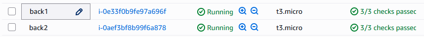
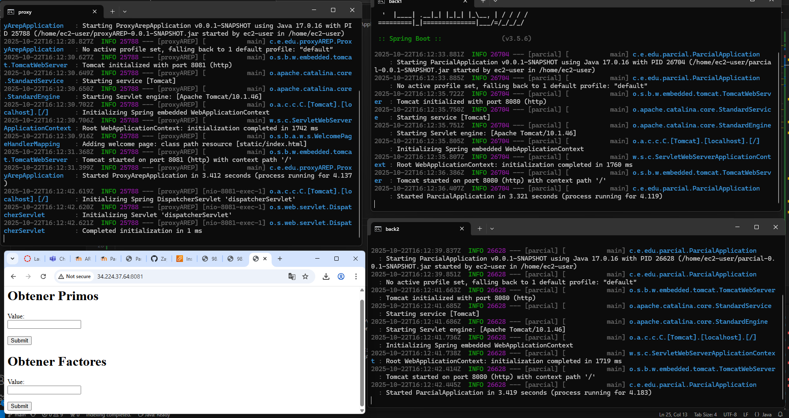
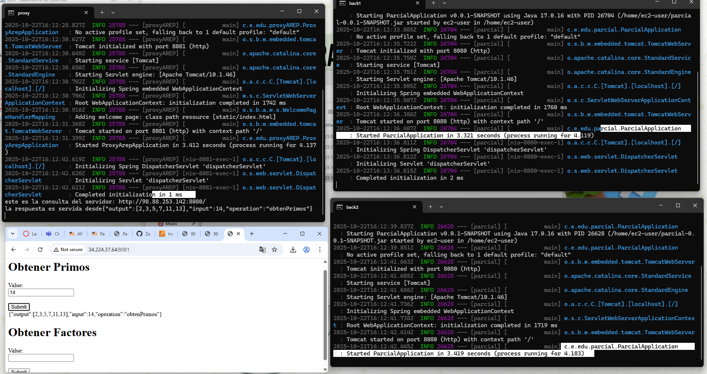
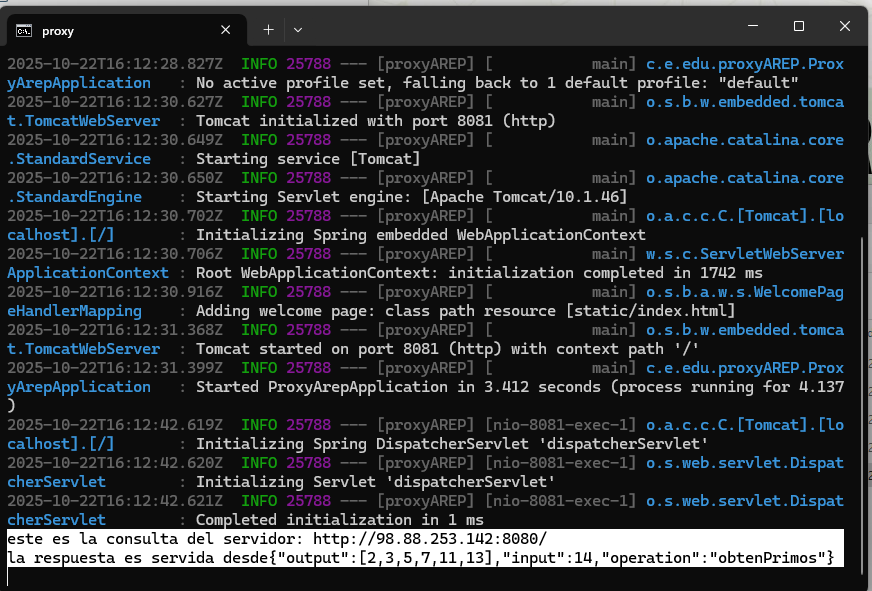
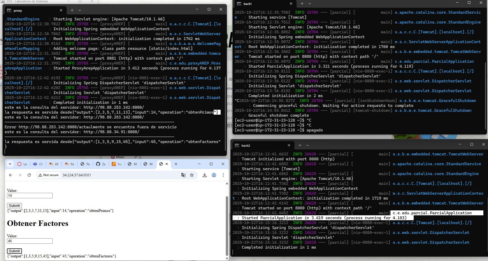
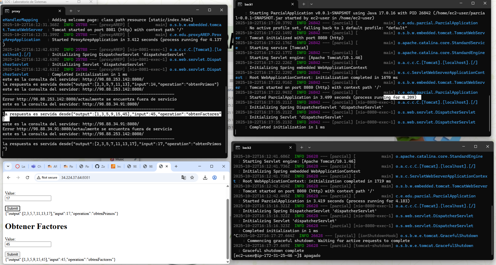

## Parcial 2 AREP

## Servidor back 

en este servidor encontraras la logica para obtener los numeros primos y los factores 

## EC2

el back esta desplegado en 2 instancias ec2 
para que cuando deje de fallar un back automaticamente pase al otro back 

tambien tenemos desplegado el proxy en otra instancia ec2
link del repo proxy:
https://github.com/ZayraGS1403/ProxyAREP2.git

## Probar funcionamiento
vamos a comprobar su funcionamiento

video:

https://youtube.com/shorts/LGiY6vqLVkU?si=6ovrUoCasTjLctfx

encendemos las 3 maquina

hacemos una peticion y se realizo al back numero 1

apagauremos el back 1 para ver que pasa

como podemos ver el proxy informa que el back esta fuera de servicio pero de igual manera respondió porque back2 

-------------------------------------------------------------------------
Error http://98.88.253.142:8080/actaulmente se encuentra fuera de servicio
este es la consulta del servidor: http://98.88.34.91:8080/
-------------------------------------------------------------------------
la respuesta es servida desde{"output":[1,3,5,9,15,45],"input":45,"operation":"obtenFactores"}

aqui apagamos el back 2 y dejamos prendido el back 1, igualmente recibimos respuesta.

